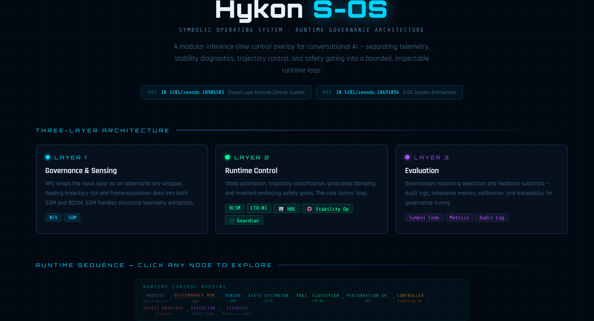

# Hykon S-OS Runtime Governance Visualiser

This repository contains an interactive architecture visualiser for the Hykon S-OS runtime governance system. Hykon S-OS is presented here as a modular inference-time governance architecture for large language models. Rather than modifying model weights or training data, it explores a complementary approach: runtime control at the conversational layer, where interaction is treated as a governable execution environment.

The visualiser illustrates how the Hykon architecture separates conversational governance into modular components, including:

NFV (Narrative Flow Validator) — adversarial pre-wrapper and trajectory risk monitor

SOM (Structural Observation Module) — structural telemetry extraction

BCSM (Boundary-Coherence Structural Module) — conversational state estimation

LTD-01 (Latent Trajectory Dynamics) — trajectory classification

HBE (Humility Balance Engine) — epistemic perturbation operator

Stability Operator — trajectory damping controller

Guardian Protocol — invariant-enforcing safety gate

Symbol Code — bounded reasoning execution

Metrics + Audit — runtime traceability and governance feedback

The visualiser provides an interactive model of the architecture’s runtime loop, allowing users to explore how telemetry, structural modelling, trajectory control, and safety gating may interact during conversational execution.

It presents the system both as a modular AI governance pipeline and as a cybernetic conversational control loop, offering an accessible way to explore the architecture described in the Hykon Stability & Alignment Suite Research Programme.
